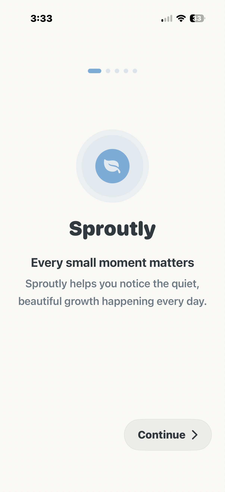
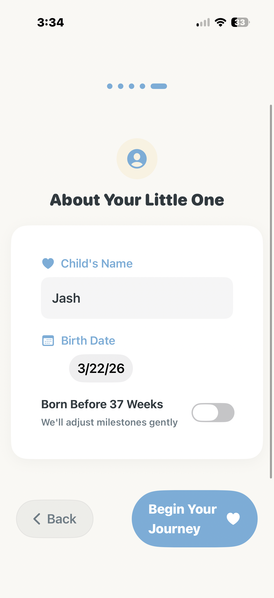
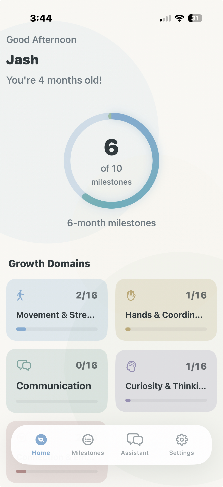
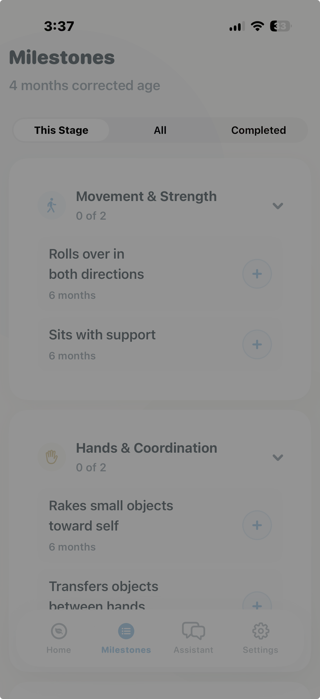
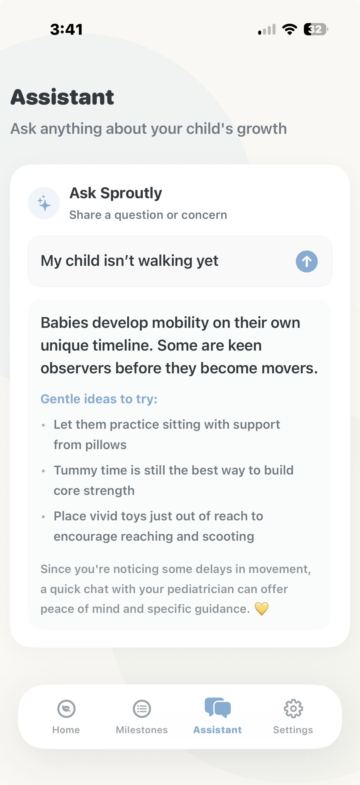
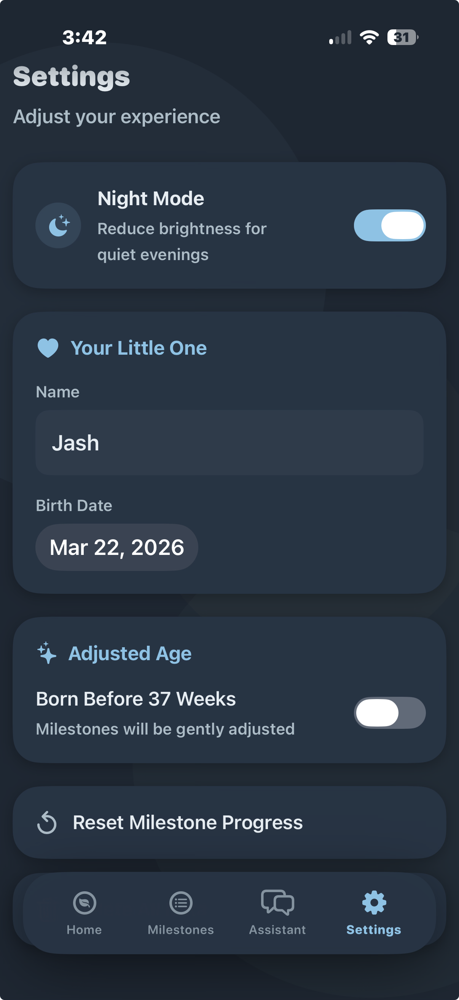

<p align="center">
  
  
  
  
</p>

<h1 align="center">
  🌱 Sproutly
</h1>

<p align="center">
  <strong>Every small moment matters.</strong>
  <br/>
  <em>A gentle, evidence-based child development tracker that helps parents notice the quiet, beautiful growth happening every day.</em>
</p>

<p align="center">
  <code>Observe → Log → Reflect</code>
</p>

---

## ✨ Philosophy

Sproutly isn't a scorecard. It's a **companion for attentive parents** — designed with warmth, grounded in pediatric milestones, and free from anxiety-inducing language. The app tracks development across five clinical domains while maintaining a tone that reassures rather than alarms.

> *"Every child blooms in their own time."*

---

## 📱 App Pages

### 🟢 1. Onboarding Flow

A five-step guided introduction that sets the tone for the entire experience.

<p align="center">
  
  &nbsp;&nbsp;&nbsp;
  
</p>

| Step | Title | Purpose |
|:----:|-------|---------|
| 1 | **Welcome** | *"Every small moment matters"* — introduces the app's warm philosophy |
| 2 | **How It Works** | Explains the three-step flow: **Observe → Log → Reflect** |
| 3 | **Reassurance** | *"There is no perfect timeline"* — sets expectations that every child is unique |
| 4 | **Important Notice** | Medical disclaimer — Sproutly is educational, not a substitute for professional advice |
| 5 | **Profile Setup** | Capture the child's name, birth date, and prematurity status (gestational age) |

**Key details:**
- Animated progress dots track the user through each step
- Prematurity toggle adjusts all milestone ages using corrected-age calculations
- Haptic feedback on navigation for a tactile, premium feel

---

### 🏠 2. Dashboard (Home)

The central hub — everything a parent needs at a glance.

<p align="center">
  
</p>

**Features on this page:**
- **Greeting Header** — Time-aware greeting with the child's name and human-readable age
- **Milestone Progress Ring** — Animated ring showing completion for the nearest age stage
- **Development Focus Card** — Appears only when earlier milestones are incomplete; uses calm, non-alarming language
- **Growth Domains Grid** — Bento-style grid with per-domain progress bars for all 5 developmental domains
- **Recent Moments** — Chronological feed of recently completed milestones with dates and optional memory notes
- **Screening Reminders** — Pediatric-recommended screening checkpoints at 9 and 30 months (with overdue detection)
- **Growth Insights** — Collapsible educational cards covering the five domains, surveillance vs screening, early intervention, and when to consult a pediatrician

---

### 📋 3. Milestones

The full milestone tracker — browse, filter, and log developmental moments.

<p align="center">
  
</p>

| Feature | Description |
|---------|-------------|
| **Segmented Filter** | Switch between `This Stage`, `All`, and `Completed` views |
| **Domain Groups** | Milestones organized by collapsible domains (Movement & Strength, Hands & Coordination, Communication, etc.) |
| **One-Tap Logging** | Tap the circle to mark a milestone as complete — with haptic feedback |
| **Memory Notes** | On completion, a sheet invites you to add a personal memory: *"What made this moment special?"* |
| **Timing Labels** | Each milestone shows its expected age range (e.g., "6 months", "2y 3m") |
| **Undo with Safety** | Unchecking a milestone with a saved note prompts a confirmation alert to prevent accidental data loss |
| **Corrected Age** | Header displays the child's corrected age for premature babies |

---

### 🤖 4. Assistant

A built-in, **rule-based support assistant** that answers parenting questions — entirely offline, with no network calls.

<p align="center">
  
</p>

**How it works:**
1. Parent types a question (e.g., *"My child isn't walking yet"*)
2. A **weighted keyword scoring engine** detects the relevant developmental domain
3. **Negative modifier analysis** gauges concern intensity (none → mild → significant)
4. A domain-specific, age-appropriate response is generated with:
   - 💬 **Reassurance** — Warm, evidence-informed messaging
   - 🎯 **Activity suggestions** — Gentle, practical ideas to try at home
   - 💛 **Pediatric note** — Surfaced when concern intensity is significant

**Supported domains:** Gross Motor, Fine Motor, Language, Cognitive, Social-Emotional

> The assistant never diagnoses. It reassures, suggests activities, and encourages pediatrician conversations when appropriate.

---

### ⚙️ 5. Settings

Personalization and data management.

<p align="center">
  
</p>

| Section | Controls |
|---------|----------|
| **Night Mode** | Toggle between warm day palette and nursery-inspired dark mode |
| **Profile** | Edit child's name and birth date (auto-saves) |
| **Adjusted Age** | Toggle prematurity and set gestational weeks (24–36 weeks) |
| **Data Management** | Reset milestone progress · Delete all data (returns to onboarding) |

---

## 🧠 Core Features

### 🎯 Five Developmental Domains

Milestones are categorized across five clinically-recognized domains:

| Domain | Icon | Label | Color |
|--------|------|-------|-------|
| Gross Motor | 🏃 | Movement & Strength | Sky Blue |
| Fine Motor | ✋ | Hands & Coordination | Warm Amber |
| Language | 💬 | Communication | Warm Teal |
| Cognitive | 🧠 | Curiosity & Thinking | Muted Lavender |
| Social-Emotional | ❤️ | Connection & Emotion | Warm Rose |

### 📐 Corrected Age for Premature Babies

For children born before 37 weeks, Sproutly automatically adjusts all milestone expectations:

```
Corrected Age = Chronological Age − (40 − Gestational Weeks) ÷ 4.33
```

This ensures milestones are evaluated fairly, with gentle messaging throughout (*"Milestones will be gently adjusted"*).

### 🔔 Pediatric Screening Reminders

Proactive cards appear on the dashboard at recommended screening ages:

| Age | Screening Type |
|-----|---------------|
| 9 months | Developmental check-in |
| 30 months | Developmental check-in |

Cards transition from **active** to **past due** with adjusted visual treatment and softer messaging.

### 🔍 Development Focus System

When earlier milestones remain incomplete, a **Development Observer** calculates per-domain completion ratios and flags areas needing attention:

| Ratio | Status | Tone |
|-------|--------|------|
| ≥ 75% | On Track | *"Growing beautifully"* |
| 50–74% | Emerging | *"Growth unfolds at its own pace"* |
| 30–49% | Needs Support | *"A little extra encouragement helps"* |
| < 30% | Worth Discussing | *"Consider discussing at your next visit"* |

Language milestones receive a **1.2× weight multiplier** to increase sensitivity, reflecting clinical importance.

### 💡 Growth Insights & Education

Expandable, collapsible educational content embedded in the dashboard:

- **The Five Domains** — What each area covers
- **Surveillance vs Screening** — The difference and how Sproutly fits in
- **Why Early Matters** — Evidence for early identification
- **When to Ask** — Signs that warrant a pediatrician conversation

---

## 🎨 Design System

### Dual-Theme Architecture

Sproutly features a carefully crafted **dual-palette** design with semantic color tokens:

| Token | Day Mode | Night Mode |
|-------|----------|------------|
| Background | `#FAF8F4` (warm off-white) | `#1C2733` (deep navy) |
| Card | `#FFFFFF` | `#243445` |
| Text | `#2F3A3F` (deep slate) | `#E6EEF3` (soft off-white) |
| Secondary Text | `#6B7C85` | `#A9BDC8` |
| Accent Blue | `#6FAED9` | `#7FC4E8` |
| Growth Green | `#8DBF9F` | `#7FBFA2` |
| Encourage Yellow | `#F4DFA5` | `#E6C977` |

### Visual Design Elements

- **Ambient Background** — Soft, overlapping gradient circles for depth
- **Warm Cards** — Rounded corners (24pt), gentle shadows, consistent padding
- **Floating Tab Dock** — Capsule-shaped bottom navigation with haptic feedback
- **Milestone Ring** — Animated progress ring with angular gradient
- **Micro-animations** — Spring-based transitions, smooth opacity fades
- **Celebration Messages** — Random, warm microcopy on milestone completion (*"You noticed something wonderful today ✨"*)

---

## 🏗️ Architecture

```
Sproutly.swiftpm/
├── MyApp.swift                  # App entry point, SwiftData container setup
├── Theme.swift                  # Dual-palette design system & view modifiers
├── ThemeManager.swift           # Observable night mode state
├── DataSeeder.swift             # Pre-populates milestones on first launch
├── PreviewMocks.swift           # Preview container helpers
│
├── Models/
│   ├── ChildProfile.swift       # @Observable profile with corrected age logic
│   └── Milestone.swift          # @Model (SwiftData) with categories & timing
│
├── ViewModels/
│   └── DashboardViewModel.swift # Computed stats, greeting text, domain analysis
│
├── Managers/
│   └── DevelopmentObserver.swift  # Per-domain scoring & status classification
│
├── Views/
│   ├── MainTabView.swift        # Floating dock navigation (4 tabs)
│   ├── OnboardingView.swift     # 5-step guided setup
│   ├── DashboardView.swift      # Home screen with all dashboard sections
│   ├── MilestonesView.swift     # Full milestone tracker with filters
│   ├── AssistantView.swift      # Container for support assistant
│   ├── SupportAssistantView.swift  # Rule-based Q&A engine
│   ├── SettingsView.swift       # Profile, theme, data management
│   ├── DevelopmentFocusView.swift  # Flagged milestone cards
│   ├── GrowthInsightsView.swift # Educational collapsible content

│
├── Components/
│   ├── MilestoneRingView.swift  # Animated progress ring
│   ├── OneTapLogButton.swift    # Haptic toggle button for milestones
│   └── ScreeningCardView.swift  # Pediatric screening reminder cards
│
└── Resources/
    └── Assets.xcassets/         # App icon & asset catalog
```

### Tech Stack

| Layer | Technology |
|-------|-----------|
| **UI** | SwiftUI (declarative, cross-platform ready) |
| **Data** | SwiftData with `@Model` and `@Query` |
| **State** | `@Observable` (Swift Observation framework) |
| **Persistence** | SwiftData (SQLite) + UserDefaults (profile) |
| **Architecture** | MVVM with domain-specific observers |
| **Concurrency** | Swift 6 strict concurrency (`@MainActor`) |
| **Min Deployment** | iOS 17.0 · macOS 14.0 |

---

## 🚀 Getting Started

1. **Clone the repository**
   ```bash
   git clone https://github.com/jashmadhani/Sproutly.git
   ```

2. **Open in Xcode or Swift Playgrounds**
   - Open `Sproutly.swiftpm` in Xcode 16+ or Swift Playgrounds on iPad

3. **Build and Run**
   - Select an iOS 17+ simulator or connected device
   - The app seeds milestone data automatically on first launch

---

## 📜 License

This project is created by **Jash Madhani**. All rights reserved.

---

<p align="center">
  <em>Built with 💛 for parents who notice the little things.</em>
</p>
